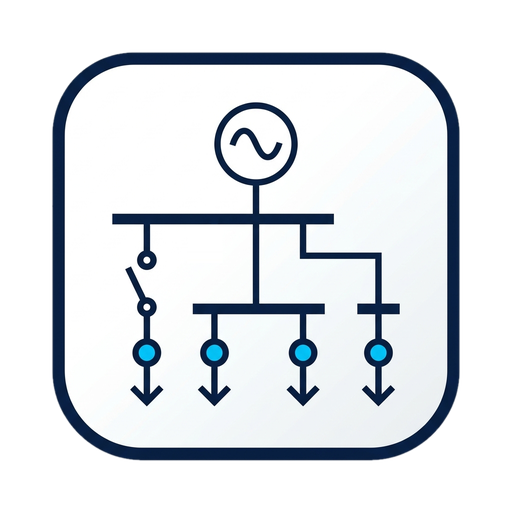

# DSSE Simulation Workbench

<div align="center">



### Distribution System State Estimation & Multi-Agent IA Workbench

[](https://github.com/luisfboff1/dsse-workbench-releases/releases/latest)
[](LICENSE)
[](#)

[📥 Download Installer (.exe)](https://github.com/luisfboff1/dsse-workbench-releases/releases/latest/download/DSSE-Workbench-Setup-0.6.2.exe) •
[🚀 Download Portable (.exe)](https://github.com/luisfboff1/dsse-workbench-releases/releases/latest/download/DSSE-Workbench-0.6.2.exe) •
[📦 All Releases](https://github.com/luisfboff1/dsse-workbench-releases/releases)

</div>

---

## ⚡ Overview

**DSSE Simulation Workbench** is an academic desktop simulation and research platform for modern electrical power distribution grids, developed as part of Luis Fernando Boff's PhD thesis at **Université Grenoble Alpes (UGA) / CNRS G2Elab**.

The workbench integrates power flow solvers, distribution system state estimation (DSSE), sensor placement analytics (PMU, SCADA, AMI), bad data detection & identification algorithms, and operational resilience pipelines into an interactive graphical interface.

### Key Capabilities

- **Power Flow Engines:**
  - AC Power Flow (Newton-Raphson via pandapower)
  - DC Linear Power Flow
  - LinDistFlow (DistFlow branch equations for radial distribution feeders)
- **State Estimation (DSSE):**
  - Weighted Least Squares (WLS) state estimation
  - Heterogeneous measurement infrastructure: SCADA, PMU (Phasor Measurement Units), AMI (smart meters), and pseudo-measurements
  - Configurable measurement variance and error threshold analysis
- **Bad Data Analytics & Cyber-Physical Resiliency:**
  - Standardized residual tests ($\chi^2$)
  - Largest Normalized Residual ($r_N^{\max}$)
  - Composite Measurement Error (CME) and leverage point detection ($K_{ii}$ hat-matrix diagnostic)
  - Reconfiguration and switch telemetry simulation (normally-open and normally-closed tie-switches)
- **Interactive Topology Graph:**
  - Interactive IEEE/CIGRE radial and meshed distribution single-line diagrams (SLD)
  - Fast canvas rendering for large networks (>3000 buses)
  - Click-to-operate switches and meter assignment

---

## 📥 Installation & Running (Windows)

### Option 1: Official Installer (Recommended)
1. Download **[DSSE-Workbench-Setup-0.6.2.exe](https://github.com/luisfboff1/dsse-workbench-releases/releases/latest/download/DSSE-Workbench-Setup-0.6.2.exe)**.
2. Run the installer. It creates desktop and start menu shortcuts and enables automatic background updates.
3. *Windows SmartScreen note:* As an academic open-source build without a paid Microsoft code-signing certificate, Windows may show a protection prompt. Click **"More info" (Mais informações) ➔ "Run anyway" (Executar assim mesmo)**.

### Option 2: Portable Executable
- Download **[DSSE-Workbench-0.6.2.exe](https://github.com/luisfboff1/dsse-workbench-releases/releases/latest/download/DSSE-Workbench-0.6.2.exe)** and double-click to run directly without installation.

---

## 🔄 Automatic Updates

DSSE Workbench features a built-in auto-updater. When a new version is released:
- The application automatically detects updates and displays a download notification banner.
- You can also manually check at any time via the **Help tab ➔ "Check for updates"** button or the top window menu **`Help ➔ Check for Updates...`**.

---

## 📜 Citation & Research

If you use DSSE Simulation Workbench in academic work or publications:

```bibtex
@phdthesis{boff2026dsse,
  author = {Luis Fernando Boff},
  title  = {State Estimation in Distribution Systems with Multi-Agent Artificial Intelligence},
  school = {Université Grenoble Alpes / CNRS G2Elab},
  year   = {2026}
}
```

---

## 📄 License

This software distribution is licensed under the [MIT License](LICENSE).
